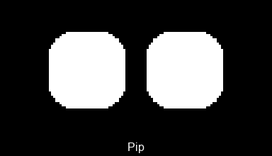

# Pip — an ESP32 desk robot with animated eyes 🤖

Pip is an **ESP32 + 128×64 OLED** showing **procedurally animated eyes**, driven by
**Claude Code** (over MCP) or a local **Ollama** chat. No board? It runs the same face in a
desktop window.

<p align="center"></p>
<p align="center">
  
  
</p>
<p align="center"></p>

## Use Pip in Claude Code

One command adds Pip to every project — no checkout needed. Pick one:

```bash
# With an ESP32 — eyes on the real OLED, over Bluetooth
claude mcp add pip-robot --scope user -- \
  uvx --from git+https://github.com/HamzaYslmn/esp-bridge-mcp-robot pip-robot

# Without hardware — eyes in an on-screen OLED window
claude mcp add pip-robot --scope user --env ROBOT_NO_DISPLAY=true -- \
  uvx --from git+https://github.com/HamzaYslmn/esp-bridge-mcp-robot pip-robot
```

Claude Code then calls Pip's `face` tool as it works (pass any mood, activity, vibe or widget
name; an optional one-shot gesture plays over it), so the eyes react live while you code. `face`
is pre‑allowed in `.claude/settings.json`; pin and `notify` tools ask first (add
`"mcp__pip-robot__*"` to pre‑approve moving hardware).

> Working inside this repo? Just open it in Claude Code and approve the checked‑in `.mcp.json`.

## Flash the ESP32 (once)

Needs a **classic ESP32** (ESP‑32S/D — S3/C3/C6/H2 are USB‑only and won't do Bluetooth), a
**128×64 I²C OLED** (SSD1306/SH1106), and [uv](https://docs.astral.sh/uv/).

```bash
uv sync                  # install deps — Python ≥3.13
uv run espbridge flash   # flash firmware over USB (once) — pick the port
uv run espbridge info    # unplug USB, confirm Bluetooth reaches the board
```

Wire the OLED **VCC→3V3, GND→GND, SDA→GPIO21, SCL→GPIO22**. The default Bluetooth password
`espbridge` matches Pip's defaults — nothing to configure.

<details><summary>Prefer the Arduino IDE?</summary>

Install the **python esp bridge** library, open *Examples → python esp bridge → Bridge*, set
the partition scheme to **Huge APP**, and Upload — the sketch is one line:
`EspBridge.begin();` (default password `"espbridge"`).
</details>

## Run it yourself

```bash
uv run src/main.py                # MCP server (default)
uv run src/main.py demo           # menu: play any mood / gesture / activity
uv run src/main.py --no-display   # no board: emulate the OLED in a desktop window
```

The emulator window is frameless and always‑on‑top — drag it by its body, **right‑click** to
resize or close (**Esc**/**Ctrl+C** quit too). Prefer local chat? Set `ROBOT_MCP=false`,
`ollama pull qwen3.5:4b`, then run and talk to Pip in the terminal.

## Configuration

`src/.env` (copy from `src/.env.example`). Every value has a default — set only what you change.

| Var | Default | Meaning |
|---|---|---|
| `ROBOT_MCP` | `true` | `true` = MCP server, `false` = Ollama chat |
| `ROBOT_NO_DISPLAY` | `false` | `true` = no board; emulate the OLED in a window |
| `ROBOT_SCREEN_PPI` | _(auto)_ | Your monitor's PPI, to size the emulator to a true 0.96″ |
| `ROBOT_BLE_TARGET` | _(auto)_ | Board name or MAC (empty = first found) |
| `ROBOT_PASSWORD` | `espbridge` | Firmware Bluetooth password |
| `ROBOT_OLED_SDA` / `_SCL` | `21` / `22` | OLED I²C pins |
| `ROBOT_BRIGHTNESS` | `255` | Panel brightness cap, 0–255 |
| `ROBOT_FPS` | `24` | Eye frame rate |
| `ROBOT_MODEL` / `OLLAMA_HOST` | `qwen3.5:4b` / `localhost:11434` | Ollama (chat mode) |

## Develop the face without an OLED

The eyes render entirely in software:

```bash
uv run src/main.py demo --no-display   # play any face live in the emulator window
```

From the menu, type **`g`** before a number or name to save a 30‑second GIF (`demo> g13`,
`demo> gzen`); `demo g13 --no-display` renders one and exits. Add a new face by dropping one
self‑contained file in `eyes/moods/`, `eyes/gestures/` or `eyes/actions/` (each exposes a single
`MOOD`/`GESTURE`/`ACTION` — see `eyes/spec.py`) and listing it in that folder's `__init__.py`.
Rebuild the showcase GIF with `uv run docs/make_gif.py`.

## Troubleshooting

- **Won't connect** — flashed? powered? `ROBOT_PASSWORD` matches? `uv run espbridge info`
  should print the chip and MAC.
- **No Bluetooth at all** — must be a *classic* ESP32; S3/C3/C6/H2 are USB‑only.
- **Blank OLED** — check SDA/SCL match `ROBOT_OLED_SDA` / `_SCL`.
- **Drops mid‑session** — Pip self‑heals; the face resumes once the board is back.
- **`uv sync` fails on a wheel** — `uv python pin 3.13 && uv sync`.

## License & sponsoring
see [LICENSE](LICENSE)